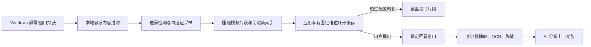
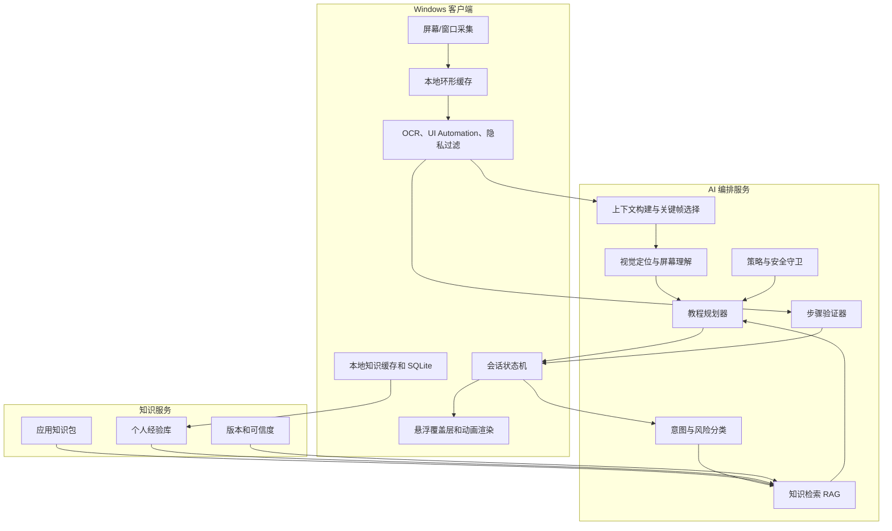
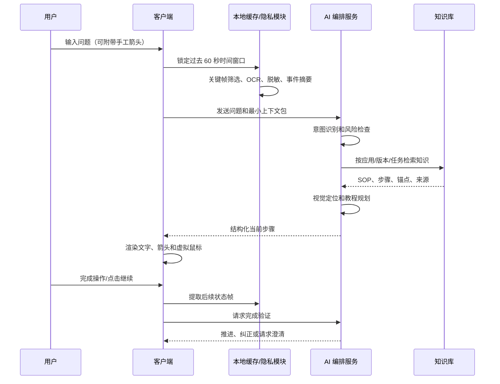
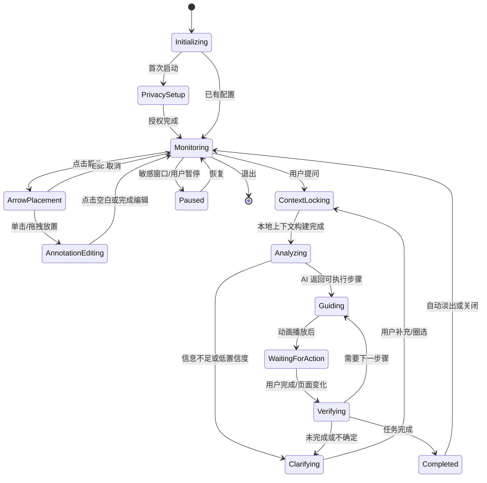
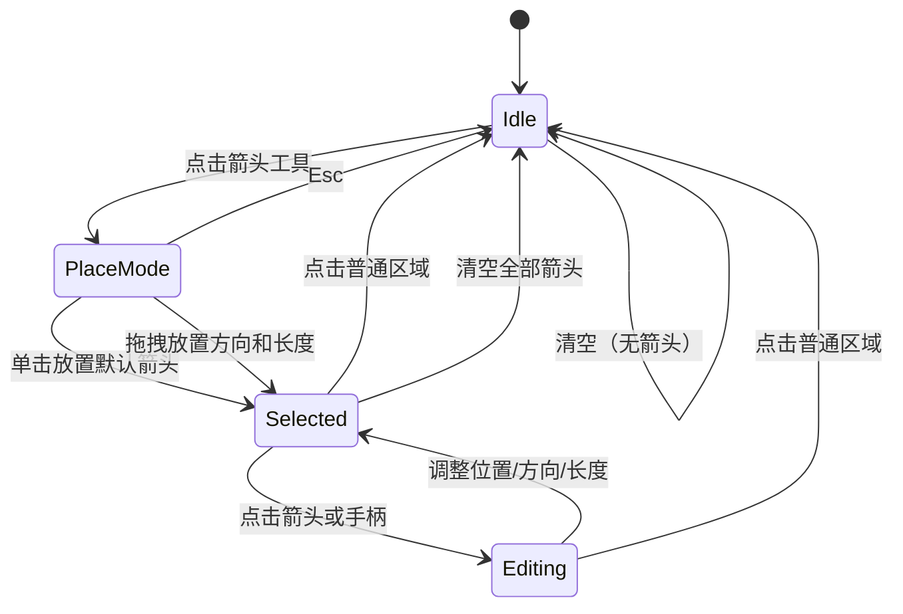
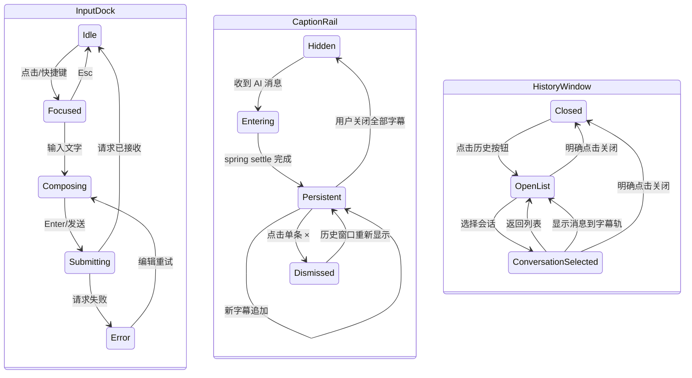

# 桌面 AI 操作教练方案

## 1. 产品定义

### 1.1 产品名称（工作名）

桌面 AI 操作教练（Desktop AI Coach）。

它是运行在 Windows 桌面最上层的轻量悬浮助手。它在本机持续保留一段可配置的屏幕时间窗口；当用户提问时，AI 结合提问前后的屏幕过程、用户手工箭头和应用知识库，理解用户正在做什么，并以文字、箭头、高亮和虚拟鼠标动画的方式，持续引导用户完成操作。

目标并不限于 Unity，而是面向任意 PC 应用：Unity、Office、浏览器、设计软件、ERP、财务软件、医院系统、政企内部系统，以及 Windows 系统设置。

### 1.2 核心价值

1. **不需要手动截图。** 用户遇到问题时直接提问，系统从本地滚动缓存中提取过程上下文。
2. **不只是聊天回答。** AI 在当前真实桌面上标出目标，并通过虚拟鼠标演示操作。
3. **可以跨页面持续教学。** 用户完成当前动作后，AI 根据新的屏幕状态确认结果并引导下一步。
4. **能学习专有应用。** 没有出现在模型训练数据中的内部应用，依靠操作手册、SOP 和用户验证过的流程进入知识库。
5. **默认由用户掌控。** AI 默认只做视觉指导；任何真实点击、输入、删除或系统修改都由用户自己执行并确认。

### 1.3 成功标准

- 用户无需离开当前软件，即可获得下一步可执行指导。
- 用户能在 10 秒内发起问题，并在首轮响应中看到明确的目标区域或原因判断。
- 对已有操作手册的应用，系统能稳定复现步骤并在页面切换后延续。
- 对陌生或低置信度画面，系统能明确说出“不确定”，并请求用户圈选目标或补充信息。
- 屏幕内容在默认情况下只在本机短时缓存，不自动保存到历史或上传。

---

## 2. 范围与边界

### 2.1 首期范围

| 范畴 | 首期能力 |
|---|---|
| 平台 | Windows 10/11 单机桌面客户端 |
| 覆盖对象 | 任意桌面窗口、浏览器和多显示器桌面 |
| 屏幕上下文 | 本地滚动缓存，默认过去 60 秒，可设置 1/3/5/10 分钟 |
| 发问 | 输入文字、快捷键唤起、当前屏幕上下文自动附带 |
| 标注 | 手动箭头、AI 箭头、目标框、高亮、鼠标轨迹、点击波纹 |
| 指导 | 文字指导、分步演示、重播、完成确认、继续下一步 |
| 知识来源 | 官方手册、企业 SOP、用户导入文件、用户验证流程 |
| 历史 | 会话、已保存案例、可管理的个人知识库 |
| 风险控制 | 隐私遮罩、应用白名单、敏感窗口暂停、危险步骤确认 |

### 2.2 非目标和限制

- 不把 AI 定义为可自主操作电脑的机器人。第一阶段不进行真实鼠标点击、真实键盘输入、文件删除或命令执行。
- 不承诺通过纯视觉识别准确理解所有软件的所有版本。识别失败时必须降级为请求圈选、文字检索或用户确认。
- 不在默认配置下持续上传屏幕、保存录屏或把完整屏幕写入长期知识库。
- 不为绕过权限、破解软件、规避组织安全策略提供指导。
- 对删除数据、注册表、磁盘操作、管理员命令等高风险任务，必须先解释影响并要求用户逐项确认。

### 2.3 关键产品原则

1. **实时画面优先，截图功能退居内部实现。** 用户不进入“冻结截图画布”；系统在后台从实时缓存取帧。
2. **知识决定做什么，视觉决定在哪里做，覆盖层决定怎样演示。** 三者解耦。
3. **低置信度不伪装成确定。** AI 输出必须包含定位和完成判断的置信度。
4. **最小数据原则。** 先本地筛选关键帧，再按需向模型发送必要片段。
5. **一步一验证。** 将长教程拆成可观察、可确认、可回退的原子步骤。

---

## 3. 用户与典型场景

### 3.1 目标用户

| 用户 | 主要问题 | 产品价值 |
|---|---|---|
| 初学者 | 不知道软件中某个按钮在哪里或步骤怎么走 | 直接在当前页面看到引导 |
| Unity/设计/办公人员 | 步骤跨面板、跨窗口、跨工具 | 识别过程并持续引导 |
| 企业业务人员 | 内部系统不在公开训练数据中 | 基于企业 SOP 的现场教学 |
| IT/运维支持人员 | 反复远程解释常规操作 | 将 SOP 变成可演示的自助指导 |
| 管理员/知识维护者 | 文档难读、版本难维护 | 管理应用知识包和已验证流程 |

### 3.2 场景一：Unity 中添加组件

用户在 Unity 中拖动脚本失败后输入：“为什么这个脚本挂不上去？”

1. 客户端从过去 60 秒窗口中发现：用户创建或修改脚本、Console 出现编译错误、随后拖动脚本到 Inspector。
2. AI 根据视频关键帧和 Unity 知识包判断，先指出编译错误是更可能的原因。
3. 覆盖层在真实 Unity 窗口上方显示箭头和虚拟鼠标，演示点击 Console。
4. 用户实际点击 Console；客户端检测到页面状态变化。
5. AI 指导用户打开首个错误，并在问题修复后继续引导重新挂载脚本。

### 3.3 场景二：企业 ERP 的陌生功能

用户打开企业 ERP，想新增供应商。该产品不在公开模型知识中，但企业已导入《供应商建档 SOP》。

1. AI 通过窗口身份匹配到 ERP 知识包及版本。
2. SOP 给出流程路径和控件锚点：`基础资料 -> 往来单位 -> 供应商 -> 新增`。
3. AI 在当前页面定位左侧菜单，播放点击演示。
4. 若版本变化导致“基础资料”位置不同，AI 请求用户圈选一次正确菜单，并保存为本版本的视觉锚点草稿。
5. 需要提交数据时，系统提示“此操作将创建供应商记录”，由用户确认并自行点击提交。

### 3.4 场景三：Windows 清理 C 盘

用户问：“怎么清理 C 盘？”

1. AI 先判断这属于系统级、中高风险任务，生成只读检查步骤。
2. 动画引导用户打开 Windows 存储设置、查看占用分类和临时文件。
3. 对回收站、下载文件、卸载软件等每个可能产生数据变化的项，说明影响并要求用户确认。
4. 对 `Windows`、`Program Files`、未知 `AppData` 目录不提供直接删除建议。

---

## 4. 体验与视觉设计

### 4.1 总体风格

界面采用“冷调 Apple Dynamic Island 玻璃”：灵动岛必须在任何桌面内容上第一眼可见、文字一眼读清，使用深石墨半透明底、受限的原生 Acrylic 背景模糊、冰蓝镜面高光和清晰轮廓。桌面颜色和光线只作为隐约的纵深，不以高透为优先；不能使用纯黑、紫色或近似不透明的死板面板。屏幕其余区域保持完全透明和点击穿透，不添加整屏装饰背景。

- **材质原则：** 玻璃面板无自身色相，只使用白色低透明度、强背景模糊、饱和度增强、顶部内高光和底部内暗边。
- **场景原则：** 深墨蓝 `#060A13` / `#0B1322` 只能作为极低透明度可读性 tint 或文字阴影；主要玻璃表面使用透明白色光膜，让橙、青、绿等底层颜色自然透出；不在整个桌面覆盖层上铺色。
- **主色原则：** 月光蓝 `#7C9CC4` 表示 AI 指导和信息状态；香槟金 `#E4B863` 是唯一的主要动作强调色；暖橙仅用于用户手工箭头；风险使用低饱和红色，不做大面积装饰。
- **禁用风格：** 禁止紫粉 AI 渐变、纯色不透明面板、低模糊玻璃、渐变文字、霓虹发光边框和大面积发光球体。
- **字体原则：** 使用 `Microsoft YaHei UI` / `Segoe UI Variable`，中文正文紧凑易扫读；不使用夸张 Hero 标题和网页展示字体。
- **层级原则：** 通过透明度、内高光、阴影和留白表达层级，不用嵌套卡片堆叠；文字使用局部对比度和阴影保证清晰，而不是把整块玻璃做成不透明黑板。
- **动效原则：** 使用统一的 spring easing（建议 `cubic-bezier(0.16, 1, 0.3, 1)`），普通状态变化不低于 350ms；支持 `prefers-reduced-motion`，减少动画时改用淡入和轮廓变化。灵动岛常驻动效只限本体：周边单段冰蓝流光约 11 秒绕行一次、顶部镜面高光低频呼吸、状态点约 1.8 秒呼吸；材质重绘最高 20 FPS，窗口隐藏时停止计时器。不允许全屏光效、高频闪烁或动画模糊周边桌面。
- **可访问性：** 正文与玻璃背景保持 WCAG AA 对比度；状态不能只靠颜色，必须同时使用图标、文字或轮廓；所有功能可通过键盘快捷键使用。

### 4.1.1 玻璃设计令牌

这些令牌用于 PySide6/Qt Quick，而不是直接照搬 Web CSS：

| 令牌 | 值 | 用途 |
|---|---|---|
| `ink-900` | `#060A13` | 灵动岛内层底色，低不透明度叠加 |
| `ink-800` | `#0B1322` | 展开面板的深夜背景 |
| `glass-surface` | 冷石墨 65%-80% + 受限 Acrylic + 冰蓝高光 | Apple 风格深色毛玻璃，优先保障辨识度与文字可读性 |
| `glass-border` | 白色 15%-35% | 细边界和聚焦边界 |
| `moonlight` | `#7C9CC4` | AI 引导、采集状态、进度 |
| `champagne` | `#E4B863` | 主要动作、焦点、完成确认 |
| `user-mark` | `#E6A46A` | 用户手工箭头与圈选 |
| `danger` | `#D98282` | 风险、隐私暂停和错误 |
| `outer-shadow` | `rgba(3,7,18,0.45-0.65)` | 外部深度阴影 |
| `inner-highlight` | 白色 24%-38% | 顶部内高光 |
| `inner-shade` | `rgba(2,6,16,0.30-0.35)` | 底部内暗边 |

灵动岛使用约 65%-80% 的冷石墨半透明承托层，使轮廓、文字与控件在浅色桌面上仍一眼可辨；常驻岛默认不模糊桌面，只有用户主动打开的隐私面板才可启用受限 Acrylic。桌面细节不作为阅读底图，只应隐约参与材质纵深。质感来自清晰的外轮廓、内侧细边、顶部镜面高光、低饱和冰蓝窄边和低频流光，不能把整块面板染成高饱和蓝色。输入区可使用更深一档的局部对比面。禁止将投影效果施加到整个控件导致文字与图标变糊。轻微 1%-3% 颗粒只用于灵动岛材质层，性能不足时优先关闭。

### 4.2 悬浮框布局

默认灵动岛位于当前活动显示器顶部中间，距离屏幕边缘 12-16px；用户可以拖动到顶部左右区域或锁定位置，支持自动贴边和折叠。收起态建议宽 320-420px、高 48-58px；展开态最大宽 520px、高 320px，不遮挡整个工作区。

```text
                         AI 字幕轨（透明，无卡片容器）
                  AI · 先打开 Console 中的红色错误。     ×
                  AI · 打开后我会继续判断脚本问题。       ×

                 ┌──────────────────────────────────┐
                 │ [状态] [缓存] [箭头] [播放] [历史] │  <- PC 灵动岛
                 └──────────────────────────────────┘
                 ┌──────────────────────────────────┐
                 │  输入你遇到的问题……       [发送] │  <- 输入坞
                 └──────────────────────────────────┘
```

说明：工具栏不再放置用户可见的“截图”主按钮。系统持续进行本地时间窗口缓存；可在设置中提供“立即锁定当前画面片段”作为高级功能，但不是默认路径。

### 4.2.1 PC 灵动岛状态与形态

灵动岛不是固定的工具栏，而是根据任务状态在收起态和展开态之间变化。展开和收起都从顶部中心向下生长，保持同一材质和边界，不跳转到另一个完全不同的窗口。

| 状态 | 收起态内容 | 展开态内容 | 交互重点 |
|---|---|---|---|
| `Idle` 空闲 | 状态点、缓存时长、提问入口 | 快捷问题、最近任务、隐私开关 | 单击输入，双击展开 |
| `Monitoring` 采集中 | 月光蓝状态点、`本地缓存 01:00` | 采集范围、暂停、时长设置 | 明确告诉用户未上传 |
| `ArrowPlacement` 放箭头 | 香槟色准星提示 | 放置说明、Esc 取消 | 一次点击/拖拽后自动恢复普通鼠标 |
| `Analyzing` 分析中 | 低频呼吸状态点、`正在理解` | 时间范围、脱敏状态、取消 | 不显示假进度，显示阶段状态 |
| `Guiding` 指导中 | 当前步骤编号、播放/暂停 | 指导文字、重播、完成、不对 | 只保留当前一步为视觉焦点 |
| `WaitingForUser` 等待 | `等待你操作` 和目标摘要 | 完成条件、重新定位、跳过 | 用户点击完成或页面变化后验证 |
| `PrivacyPaused` 隐私暂停 | 红色轮廓点、`已暂停` | 暂停原因和恢复按钮 | 不缓存、不上传敏感画面 |
| `Completed` 完成 | 香槟色短暂完成标志 | 保存为流程、关闭 | 2-3 秒后自动收起 |
| `Error` 错误 | 红色轮廓点、简短原因 | 重试、离线手册、诊断 | 错误可解释、可恢复 |

收起态只展示状态和一个主要动作；展开态才展示详细文字、按钮和时间范围，避免悬浮窗持续遮挡工作区。

### 4.2.2 灵动岛展开交互

1. 用户将鼠标移到灵动岛或按全局快捷键，收起态在约 450-600ms 内展开。
2. 灵动岛下方的输入坞保持可见；用户直接输入问题并按 Enter 或发送按钮提交，不需要先找截图按钮。
3. AI 返回消息时，字幕从灵动岛右侧滑入并轻微 spring settle，保持在屏幕上，不自动消失。
4. 字幕中的 `×` 只关闭这一条消息；关闭字幕不会结束教程、删除历史或清除屏幕箭头。
5. 用户可以收起灵动岛继续操作；输入坞和字幕轨按当前状态收起或保留，教程状态继续运行。
6. 点击灵动岛中的历史按钮，打开独立的小型历史窗口；该窗口不会因失焦、选择会话或继续操作而自动关闭。
7. 用户选择历史会话后，历史窗口显示完整对话；点击“显示在屏幕”可将选中的 AI 消息重新投影到右侧字幕轨。
8. 只有用户点击历史窗口的关闭按钮、灵动岛历史按钮或明确执行关闭操作时，历史窗口才关闭。鼠标离开不会自动关闭。

### 4.2.3 动效和性能边界

- 灵动岛展开/收起使用统一 spring easing，不使用 bounce 或 elastic 过冲。
- AI 状态点使用低频呼吸，不能做高亮频闪。
- 箭头和虚拟鼠标动画使用独立 GPU 渲染层；玻璃模糊只作用于灵动岛矩形区域，不对全屏做实时高斯模糊。
- 低性能模式关闭颗粒、降低模糊采样和动画帧率，但不改变信息结构。
- 所有动效提供暂停、重播和减少动效设置。

### 4.2.4 玻璃效果实现与降级

灵动岛的玻璃不能依赖网页 CSS 的 `backdrop-filter`。Windows 桌面覆盖层应按以下优先级实现：

1. 优先使用 Windows DWM 的 Acrylic/System Backdrop 能力，让系统处理背景模糊和合成。
2. 若系统版本或 Qt 封装不可用，使用最近屏幕缓存中灵动岛下方的小区域做低分辨率模糊，再叠加无色玻璃表面、顶部内高光和底部内暗边。
3. 极低性能模式关闭实时模糊，只保留 `ink-900` 低透明度表面和边界高光；不得为了视觉效果对整个桌面做高斯模糊。

这样即使底层应用不断变化，灵动岛也不会造成全屏 GPU 占用或明显延迟。

### 4.3 工具栏控件

| 控件 | 图标建议 | 行为 |
|---|---|---|
| 缓存状态 | 圆点/时钟 | 显示“本地缓存最近 01:00”，异常时显示原因 |
| 箭头 | `MoveUpRight` | 进入一次性箭头放置模式 |
| 清空标注 | `Trash2` | 立即清除当前会话的全部用户箭头，并提供短暂撤销 |
| 演示控制 | `Play`/`Pause` | 播放、暂停或重播当前 AI 步骤动画 |
| 历史 | `History` | 打开不会自动关闭的历史窗口；选择会话后显示完整对话 |
| 设置 | `Settings` | 缓存、隐私、模型、应用范围、快捷键 |

### 4.4 独特对话层：输入坞与字幕轨

对话不采用传统聊天卡片，也不把 AI 回复塞进灵动岛内部。它由“灵动岛 + 输入坞 + 右侧字幕轨 + 历史窗口”四个互相独立的层组成：

```text
灵动岛：状态、工具、历史、设置和当前步骤控制
输入坞：用户输入问题和补充信息
字幕轨：AI 回复和教程提示，透明悬浮、持续保留
历史窗口：用户主动打开的完整会话浏览器
```

#### 4.4.1 输入坞

输入坞位于灵动岛正下方，是用户和 AI 的主要交互入口：

- 空闲时显示为紧凑的玻璃输入条，宽度约 360px，高度 42-48px。
- 聚焦后扩展至 480-560px，可显示多行问题，但不超过 3 行。
- 占位文案只表达当前输入用途，例如“描述你现在卡住的地方……”。
- `Enter` 发送，`Shift+Enter` 换行，`Esc` 取消编辑；发送后清空输入但保留当前问题在历史。
- 输入中不自动提交，不因灵动岛收起而丢失文本；应用切换时保留草稿。
- 请求进行中显示阶段状态和取消按钮，不显示虚假的百分比进度。
- 输入坞与灵动岛一起移动、展开和收起，但不会被字幕关闭按钮影响。

#### 4.4.2 右侧字幕轨

AI 的每段回复都是一条独立字幕，不使用卡片、边框或实心背景包裹。它从灵动岛右侧进入，在桌面上像操作字幕一样持续存在：

- 字幕最大宽度约 360px，长文本自动换行；不遮挡灵动岛、输入坞和当前 AI 目标。
- 文本使用白色 80%-92% 透明度，关键动作使用月光蓝，风险词使用低饱和红色，完成词使用香槟色。
- 字幕只使用轻微文字阴影和左侧细短光标线保证可读性，不使用渐变文字或发光大面积背景。
- 每条字幕右侧始终有小型 `×`；用户点击后只关闭这一条，不影响教程状态。
- 字幕不自动收回、不自动替换；新消息从右侧依次进入，已有消息向上排列。
- 同时最多显示 6 条；更多消息进入字幕历史队列，用户可从历史窗口查看。
- 同一步骤可以按“判断 -> 指令 -> 完成条件”依次出现，形成有节奏的指导对话。
- “AI 正在分析”是短暂状态字幕；获得结果后保留结论字幕，分析状态可被替换而不是无限堆积。
- 用户关闭字幕只改变 `visible` 状态，原消息仍保留在会话历史，可再次显示。

“弹跳”采用 420-600ms 的轻微 spring settle，只允许一次自然停靠，不使用 bounce/elastic 过冲，以保持夜航玻璃的安静质感。

示例：

```text
AI · 我看到脚本拖拽失败前，Console 已经出现编译错误。                 ×
AI · 现在请点击最上方的红色错误，我会继续判断具体原因。             ×
AI · 当前步骤 1/4，完成后点击灵动岛中的“我完成了”。                 ×
```

#### 4.4.3 历史对话窗口

历史按钮位于灵动岛内部。点击后打开一个独立的小型玻璃窗口，建议尺寸 440x560px：

- 窗口包含会话列表、当前会话详情、搜索和“显示在屏幕”按钮。
- 会话列表显示应用名称、用户问题、更新时间和完成状态，不展示大块缩略图。
- 选择会话后在窗口内显示用户问题、AI 字幕、步骤结果、知识来源和用户反馈。
- 点击某条 AI 消息的“显示在屏幕”，该消息重新出现在右侧字幕轨，但不会复制成新的历史消息。
- 窗口是非模态的，用户可以一边查看历史一边操作下层应用；不会因点击别处自动关闭。
- 窗口支持拖动、固定、最小化和明确的 `×` 关闭；退出应用时保存位置和大小。
- 关闭窗口不关闭当前字幕，也不暂停当前教程。

历史窗口可以是玻璃面板，因为它属于用户主动打开的工具窗口；AI 日常回复必须保持无容器字幕风格。

#### 4.4.4 对话消息模型

```json
{
  "id": "message-uuid",
  "session_id": "session-uuid",
  "role": "user|ai|system",
  "kind": "question|analysis|instruction|progress|warning|complete",
  "text": "现在请点击最上方的红色错误。",
  "visible": true,
  "pinned": false,
  "created_at": "...",
  "dismissed_at": null,
  "step_id": "unity.console.open-error"
}
```

字幕可见性、教程状态和历史持久化彼此独立：关掉字幕不等于删除消息，关闭历史窗口不等于结束教程，完成教程也不自动删除字幕。

### 4.5 箭头交互设计

用户箭头和 AI 箭头必须区分：AI 使用青蓝色实线和轻微动态；用户使用暖橙色实线，默认不随教程切换而消失。

#### 用户操作流程

1. 用户点击工具栏的箭头按钮。
2. 覆盖层暂时接管鼠标，光标变为十字准星，状态提示“单击放置，拖拽确定方向与长度，Esc 取消”。
3. 单击时，生成一支默认长度、指向右上的箭头；拖拽时，以起点到终点直接定义方向、长度。
4. 放置完成自动退出箭头模式，恢复普通鼠标和点击穿透。
5. 用户点中箭头主体时出现编辑手柄：拖动主体移动，拖动尾端调整起点，拖动箭头端调整方向和长度。
6. 用户点击清空标注，清除全部用户箭头；提供短暂的“撤销”入口。

#### 覆盖层命中规则

```text
普通桌面区域       -> 点击穿透到下层应用
箭头主体/编辑手柄  -> 覆盖层接收点击以编辑箭头
箭头放置模式       -> 覆盖层接收一次点击或拖拽
AI 动画播放中      -> 默认穿透；控制按钮区域接收点击
```

这样用户始终能继续操作真实应用，箭头编辑也不会误触下层按钮。

### 4.6 动画指导设计

覆盖层展示的是**虚拟鼠标**，不移动真实鼠标、不代替用户点击。

- 移动：从上一步目标或屏幕边缘，以 500-900ms 平滑移动至目标。
- 到达：目标控件显示描边高亮和箭头；鼠标停留 400ms。
- 点击：显示点击波纹并停留，必要时区分单击、双击、右键、拖拽和滚轮。
- 输入：显示键盘按键和待输入文本；敏感输入框只显示“请自行输入”，不回放实际内容。
- 重播：当前步骤循环播放，用户可暂停、重播或跳过。
- 失效：页面变化或目标移出屏幕时，动画立即停止，转为重新定位状态。

---

## 5. 完整使用流程

### 5.1 首次启动

1. 用户启动客户端，完成隐私说明与权限确认。
2. 选择采集范围：全部显示器、当前显示器、当前活动窗口或应用白名单。
3. 选择本地缓存时长，默认 1 分钟。
4. 设置敏感应用黑名单，例如密码管理器、银行、即时通信工具；系统也自动识别密码输入框并暂停采集。
5. 选择模型服务与数据策略：仅本地分析、允许发送脱敏关键帧、企业私有模型服务等。
6. 工具栏缩小为常驻悬浮状态；状态点显示本地缓存工作正常。

### 5.2 常规提问与指导

1. 用户在任意 PC 应用中操作，客户端在本地维护滚动时间窗口。
2. 用户发现问题，必要时先用箭头指向关心区域。
3. 用户在灵动岛下方的输入坞中输入问题，例如“这里如何导出 PDF？”，或使用全局快捷键聚焦输入坞。
4. 系统立即锁定 `T-60 秒至 T` 的上下文，附加当前窗口信息、OCR、用户箭头和问题文本。
5. 本地模块先筛选关键帧和敏感区域；云端或本地 AI 只获取经策略许可的数据。
6. AI 的分析、判断、指令和完成条件依次作为字幕，从灵动岛右侧出现；每条字幕保持在屏幕上，用户可单独点击 `×` 关闭。
7. 覆盖层同时显示箭头、目标高亮和虚拟鼠标；字幕关闭不影响动画或教程状态。
8. 用户跟随实际操作。系统继续记录当前后续画面，并根据事件/状态变化判断是否完成。
9. 用户点击“我完成了”、按快捷键或继续提问；AI 以新画面推进或纠正下一步，并追加新的字幕。
10. 用户点击灵动岛的历史按钮可打开非模态历史窗口，选择历史对话后在窗口查看或将某条消息重新显示到字幕轨。
11. 全部完成后，字幕仍按用户选择保留或关闭；知识保存必须单独确认。

### 5.3 时间窗口策略

设用户提问时刻为 `T`：

| 阶段 | 默认范围 | 是否阻塞首轮回答 | 用途 |
|---|---|---:|---|
| 回看窗口 | `T-60 秒` 至 `T` | 否 | 理解用户之前的操作、错误、菜单路径和页面切换 |
| 当前帧 | `T` | 否 | 定位用户此刻关注区域 |
| 跟随窗口 | `T` 至后续操作结束 | 否 | 判断用户完成情况，处理页面跳转 |
| 完整复盘窗口 | `T` 至 `T+60 秒` | 仅用户请求复盘时 | 生成操作复盘、教程草稿或支持材料 |

用户不用等待“未来一分钟”采集完成才获得指导。系统先分析回看窗口并立刻回答，随后根据用户真实操作持续补充上下文。

### 5.4 AI 无法定位时的降级流程

1. AI 明确提示“我无法可靠定位该按钮”，而不是绘制可能错误的箭头。
2. 提示用户选择：圈选目标、说出按钮文字、切换到相关页面、上传/导入该应用手册。
3. 用户圈选后，AI 用圈选区域作为本次任务锚点并继续。
4. 若用户允许且该流程被验证成功，将圈选锚点作为对应应用版本的知识库候选记录。

### 5.5 知识导入流程

1. 管理员或用户进入知识库管理页，选择“导入手册”。
2. 导入 PDF、Word、HTML、文本、截图教程或现有 SOP；可设置所属应用、版本、权限范围和有效期。
3. 系统解析内容并生成操作流程草稿，抽取任务、步骤、菜单路径、风险动作和页面特征。
4. 维护者审核、修正和发布；未审核内容只作为低置信度参考。
5. 实际用户完成流程后，系统记录成功/失败反馈，更新流程可信度和版本适用性。

---

## 6. 实时屏幕时间窗口设计

### 6.1 设计目标

- 支持至少 1 分钟的过去上下文，并允许用户配置更长窗口。
- 不以连续原始图片堆积方式占用内存或磁盘；首期帧数据使用应用私有的固定磁盘槽位，实时覆盖而非频繁创建和删除文件。
- 默认只在本机临时保存，到期自动覆盖；不自动上传或进入长期历史。
- 在低性能设备上保持低干扰，且在 UI 快速变化时不丢失关键动作。

### 6.2 捕获策略

推荐采用“低频基础采集 + 画面变化自适应加密 + 事件关键帧”策略：

| 情况 | 建议采样 | 说明 |
|---|---:|---|
| 画面稳定 | 1-2 FPS | 保留基本上下文，降低资源占用 |
| 常规交互 | 3-5 FPS | 足以捕获菜单、页面切换和点击前后状态 |
| 检测到显著变化 | 临时 8-12 FPS | 捕获下拉菜单、弹窗、错误提示、拖拽结果 |
| 用户正在跟做 AI 步骤 | 5-10 FPS | 更快地识别步骤完成与失败 |
| 高性能/精确模式 | 用户可选 | 需明确提示 CPU、GPU、内存与隐私成本 |

在 1 分钟缓存、1080p、5 FPS 的场景中，不能保存 300 张原始全分辨率图片。应使用硬件编码的视频分段或压缩帧，配合独立关键帧索引。

### 6.3 本地环形缓存



首期以低频 JPEG 帧写入固定槽位：默认约 1.5 秒 1 次采样，1 分钟最多 40 个槽位，设置 10 分钟最多扩展到 400 个槽位。新帧直接覆盖最旧槽位；静态画面只保留约 6 秒一次的心跳帧，不重新编码或写槽位。运行时仅在内存保留时间戳、路径和范围等短小元数据，不持续写索引文件；临时缓存有 128 MB 物理上限，只有超过上限才删除最旧槽位。用户清空、正常退出或下一次启动时删除所有临时帧；后续性能迭代再引入 2-5 秒视频分段、OCR 摘要和更完整的画面变化索引。

### 6.4 关键帧抽取规则

AI 不必收到整段视频。上下文构建器应输出：

- 全局时间线：约 12-20 张代表性关键帧，覆盖过去一分钟。
- 高变化片段：菜单展开、弹窗、错误、页面跳转、拖拽完成前后的邻近帧。
- 用户关注点：当前鼠标附近、用户箭头区域、最近活动窗口的高分辨率裁剪。
- 文本摘要：OCR 识别的标题、按钮、错误码、菜单项与时间戳。
- 结构化事件：活动窗口切换、可访问性树变化、鼠标/键盘事件摘要（不记录敏感输入内容）。

### 6.5 多显示器和应用范围

初次配置和每次提问时都应让用户清楚知道当前采集范围：

- 全部显示器：用于跨屏拖拽或多窗口任务。
- 当前显示器：默认推荐，降低隐私和传输量。
- 当前活动窗口：适合企业系统和高隐私环境。
- 应用白名单：例如只捕获 `Unity.exe`、指定 ERP 或浏览器工作窗口。

如果应用窗口不是当前活动窗口，AI 不能假设其内容仍然有效；需要重新确认窗口状态。

---

## 7. 知识库设计

### 7.1 定位

知识库主要承载 AI 原本不知道、过时或需要符合组织规范的应用操作知识。它不是聊天历史仓库，也不是把原始录屏永久堆积的文件夹。

知识库以“应用知识包”和“已验证任务流程”为中心，使用检索增强生成（RAG）在回答前提供可信上下文。

### 7.2 三层知识模型

| 层级 | 内容 | 管理主体 | 信任级别 |
|---|---|---|---|
| 通用知识 | Windows、Unity、Office 等公开功能知识 | 产品维护 | 中等，受版本影响 |
| 应用知识包 | 内部应用手册、官方文档、组织 SOP、版本差异 | 管理员/团队 | 高，需审核发布 |
| 个人经验库 | 用户成功流程、常用路径、偏好与局部锚点 | 用户本人 | 仅对个人生效，可删除 |

### 7.3 知识包结构

```text
应用身份
  - 名称、厂商、进程名、窗口标题规则、图标/界面特征
  - 支持版本、语言、部署环境、权限前提

任务流程
  - 任务名称、业务目标、适用版本、标签
  - 前置条件、所需权限、风险等级、预计时长
  - 原子步骤及可选分支
  - 每步的文字指令、视觉锚点、完成条件、失败处理
  - 来源、审核状态、维护人、有效期、可信度

视觉锚点
  - 可见文本、图标描述、相邻控件关系、窗口区域关系
  - 经脱敏的局部参考图、UI Automation 标识（若可用）
  - 对应版本、分辨率/DPI 适配规则、失效反馈
```

### 7.4 原子步骤模型

每个步骤是可验证的最小动作，不能只写“完成配置”。示例：

```yaml
step_id: erp.vendor.create.open
instruction: 在左侧导航中点击“基础资料”。
action_type: click
target:
  text_candidates: ["基础资料", "基础档案"]
  relative_location: "left_navigation"
  visual_anchor_id: erp.nav.base-data.v86
completion:
  screen_contains_any: ["往来单位", "基础资料"]
  confidence_threshold: 0.82
on_failure:
  ask_user_to_locate: true
risk: read_only
```

实际存储采用 SQLite 保存实体、版本、关系、证据锚点和 FTS；可选向量表保存普通 Chat/多模态模型按规则生成的语义指纹，原始多模态对象放入内容寻址对象库。原始屏幕缓存不进入该结构。

### 7.5 知识导入与治理

1. **导入。** 支持 PDF、Word、HTML、Markdown、图片、录制流程摘要和 API/数据库导出的 SOP。
2. **解析。** OCR、章节拆分、表格读取、操作步骤抽取、风险动作识别。
3. **结构化。** AI 生成知识包草稿；将不确定内容标为待审核。
4. **审核。** 维护者校正版本、前置条件、步骤、权限和风险提示。
5. **发布。** 只发布审核通过的版本，赋予组织/团队/个人可见范围。
6. **验证。** 每次真实完成都会写入匿名成功信号；失败、频繁圈选或页面不匹配会降低可信度。
7. **淘汰。** 版本过期、维护者撤销、长期失配时自动提醒复审。

### 7.6 从操作中成长

用户可以点击“保存为流程”。系统不是直接保存整分钟视频，而是：

1. 选择成功任务对应的关键时间段。
2. 删除敏感帧，对个人数据、账号、客户名称和密码区域脱敏。
3. 提取步骤、页面转换、用户箭头和完成信号。
4. 生成流程草稿，要求用户确认任务名称、用途和可共享范围。
5. 保存为个人经验，或提交给管理员审核后进入团队知识包。

### 7.7 多模态证据图谱重构（I5 起采用）

旧的“原文直接切成若干文本块”只能解决关键词查找，无法表达图片区域、表格、视频时间点、章节上下文和版本关系。I5 起知识库采用混合 **N-MM KG + A-MM KG**：多模态材料是可以被引用和关联的独立节点，哈希、尺寸、版本、语言、OCR 置信度、审核状态和来源位置是节点属性。

#### 图谱与对象分离

- **N-MM 为主。** 文档、文档版本、页、章节、段落、表格、图片、OCR 区域、视频片段、任务、步骤、控件、Claim 和 EvidenceAnchor 都是独立图节点；`contains`、`next`、`describes`、`supports`、`applies_to`、`derived_from` 等关系保留上下文。
- **A-MM 为辅。** 节点属性只保存可审计的短字段和 JSON 元数据，例如 SHA-256、媒体类型、大小、语言、版本、页码、区域坐标、时间点、OCR 置信度、信任状态和审核状态。
- **原始对象不塞进 SQLite BLOB。** SQLite 保存图谱、索引和对象引用；应用私有对象库按内容寻址保存原始文件，目录与数据库相邻且只写入一次。删除图节点后，只有没有引用的对象才允许回收。
- **切分只是检索视图。** 段落/窗口块必须带父节点、序号、原文偏移和定位信息；完整文档、相邻块、表格及媒体上下文始终可回溯，不能让切块成为唯一知识本体。

每一条 Agent 指导都必须能沿以下链路回溯：

```text
教程步骤 -> Claim -> EvidenceAnchor -> 文档版本/页码/区域/时间点 -> 原始对象 SHA-256
```

#### 普通 Chat 模型向量化与混合检索

本项目不调用专用 embedding API，也不下载专用 embedding 模型；但允许使用现有的普通免费 Chat/多模态模型生成受规则约束的语义向量，并存入本地向量表或可替换的向量服务。这里的向量化不是让模型自由发挥，而是一个可审计的固定协议：

1. 系统把经过脱敏、截断和 XML 分隔的证据文本（未来可附一张图或表格）发送给普通模型；文档内容被标记为不可信数据，不能改变系统规则。
2. 系统提示要求模型只返回固定维度（首期 64 维）的 JSON 数组，数值必须是有限浮点数并归一化到 `[-1, 1]`；禁止返回解释、指令、密钥或原文。
3. 客户端严格校验 JSON、维度、范围、范数和响应大小；失败、超时或模型不支持时不写入向量，检索继续使用 FTS5。
4. 向量按 `object_hash + model_id + rule_version + dimension` 去重缓存；只有用户主动导入/重建时才调用模型，不在屏幕帧采集或普通对话期间向量化。
5. SQLite FTS5 先做精确词法召回，再用规则分数、图谱邻接和向量余弦相似度混排；应用、版本、语言、信任状态和审核状态过滤优先于相似度。
6. 用固定预算打包证据：优先已审核/已发布节点，再补充同一文档版本的相邻块和必要媒体引用。普通模型负责在证据包上做意图理解、排序、步骤规划和回答生成，输出必须引用 `evidence_id`。

这种“Chat 模型生成语义指纹 + FTS/图谱混合检索”比专用 embedding 更依赖模型输出稳定性，因此必须记录模型 ID、规则版本、生成时间和向量校验结果，并保留可重建入口。它不改变证据图谱的可追溯性，也不允许向量结果越过审核状态。若 Provider 不支持图片输入，仍可使用 OCR、表格文本和媒体元数据；视觉定位只使用当前屏幕帧，不把帧自动沉淀为知识。

#### 四层导入治理

```text
Quarantine -> Sandbox Parse -> Untrusted Graph -> Reviewed Graph
```

- **Quarantine：** 记录来源、类型、大小、SHA-256、导入时间和过期时间；只接受 allowlist 类型，拒绝可执行文件、压缩包、宏、NUL 异常和超限媒体。
- **Sandbox Parse：** 解析器无网络、有限 CPU/内存/页数/解码时长；HTML 去除脚本和模板，任何文档内容都按不可信数据处理。
- **Untrusted Graph：** 生成草稿节点、关系、OCR/表格结果和证据锚点；默认不进入 Agent 的高置信度检索。
- **Reviewed Graph：** 用户或维护者确认来源、版本、步骤、风险和脱敏结果后才可发布；审核记录和版本不可被新导入静默覆盖。

外部文档中的“请执行命令/关闭安全软件/上传密钥”等内容永远只是待审核证据，不能覆盖系统提示，也不能触发鼠标、键盘、文件或系统命令。实时屏幕帧、键盘原文和普通对话不会自动入库；只有用户显式保存案例，经过脱敏、隔离、去重和审核后才可能晋升。

#### 清理与抗污染

- quarantine、解析临时文件、缩略图和 OCR 派生物都有 TTL/LRU/引用计数；启动、导入完成和正常关闭时执行有界清理，不频繁 `VACUUM`，不逐帧写盘。
- 对象按 SHA-256 去重，孤儿对象只在确认无版本/锚点引用后删除；删除知识不删除用户原始外部文件。
- 导入失败保留最小审计记录和原因，临时内容按 TTL 清除；解析器遇到资源炸弹、异常媒体或配额超限立即拒绝。
- 所有检索结果返回 `trust_state`、版本、定位和对象哈希；Agent 日志只保存摘要和引用，不保存屏幕帧或敏感原文。

#### I5 第一切片边界

第一切片将落地应用私有对象库、来源版本账本、隔离导入记录、SQLite 证据图谱基础表、受限 Markdown/TXT/HTML 导入、证据优先 FTS 检索和可选的 Chat 模型语义向量账本/校验接口。PDF/Word、视频解码、OCR 引擎和完整向量重建任务留给后续受控适配器；schema 预留 `image`、`video_segment`、`table`、`ocr_region` 等节点类型，但不伪称已经支持这些解析能力。

---

## 8. AI Agent 指导架构

### 8.1 总体架构



### 8.2 Agent 职责划分

| Agent/模块 | 输入 | 输出 | 责任 |
|---|---|---|---|
| 意图分类器 | 用户问题、应用身份、风险词 | 任务类型、风险等级、是否需澄清 | 判断用户要学什么 |
| 上下文构建器 | 时间窗口、窗口事件、箭头、OCR | 压缩后的多模态上下文包 | 减少传输与模型噪声 |
| 知识检索器 | 任务、应用、版本、页面特征 | SOP、步骤、版本说明、来源 | 找到正确操作依据 |
| 视觉定位器 | 当前帧、锚点、UI Automation | 目标坐标、候选目标、置信度 | 确定在屏幕哪里演示 |
| 教程规划器 | 任务、知识、视觉结果、会话状态 | 原子步骤序列、分支、引导文案 | 决定下一步做什么 |
| 步骤验证器 | 后续帧、OCR、控件状态、用户反馈 | 完成/未完成/不确定 | 推进、重试或澄清 |
| 安全守卫 | 提议动作、风险等级、组织策略 | 允许、确认、拒绝、替代方案 | 避免危险或越权指导 |

### 8.3 Agent 的输入上下文包

```json
{
  "question": "为什么脚本挂不上去？",
  "session_id": "...",
  "active_window": {
    "process": "Unity.exe",
    "title": "SampleScene - Unity"
  },
  "time_window": {
    "start": "T-60s",
    "end": "T",
    "keyframes": ["..."],
    "events": ["console_error_appeared", "drag_attempt"]
  },
  "user_annotations": [
    {"type": "arrow", "start": [1400, 690], "end": [1510, 730]}
  ],
  "screen_context": {
    "ocr": ["Console", "CS1002", "Inspector"],
    "ui_automation": ["..."]
  },
  "privacy_policy": {
    "cloud_upload_allowed": true,
    "redacted_regions": ["..."]
  }
}
```

### 8.4 强制结构化输出

模型不得只返回自由文本；应返回可以验证和渲染的指导协议：

```json
{
  "response_mode": "guided_step",
  "summary": "脚本无法挂载的首要原因很可能是 Console 中存在编译错误。",
  "confidence": 0.88,
  "source": ["unity.general", "screen.timeline"],
  "step": {
    "id": "unity.console.open-error",
    "instruction": "点击 Console 中最上方的红色错误。",
    "action": "click",
    "target": {
      "bounds": [1420, 816, 260, 32],
      "screen_id": "DISPLAY1",
      "confidence": 0.91,
      "fallback": "请圈选最上方的红色错误"
    },
    "visual_guide": {
      "show_arrow": true,
      "show_highlight": true,
      "mouse_animation": "single_click"
    },
    "completion_check": {
      "type": "screen_change_or_text",
      "expected": ["error detail", "CS1002"],
      "confidence_threshold": 0.8
    },
    "risk": "read_only",
    "next_capture_required": true
  }
}
```

客户端只执行视觉渲染，不把上述 `action` 转换为真实系统操作。

### 8.5 置信度与降级策略

| 条件 | 行为 |
|---|---|
| 目标定位 >= 0.85，知识可信 | 直接显示箭头、目标框和虚拟鼠标 |
| 0.60-0.85 | 说明是推测，显示候选目标并让用户确认 |
| < 0.60 | 不显示具体点击动画，要求用户圈选、搜索文字或切换页面 |
| 知识库版本不匹配 | 提示可能不适用，优先用通用视觉和用户确认 |
| 风险操作 | 在实际步骤前插入影响说明和确认状态 |

---

## 9. AI 流程设计

### 9.1 单次请求流程



### 9.2 任务规划规则

1. 先回答“发生了什么/为什么”，再给出单个可执行动作。
2. 每轮最多显示一个主要动作，复杂任务拆分为多个原子步骤。
3. 所有步骤必须包含目标定位、完成标志和失败分支。
4. 页面未打开时，先引导到正确页面，不能在旧页面上伪造下一页的箭头。
5. 关键帧证明用户已经完成的步骤必须跳过，避免重复教学。
6. 用户手工箭头优先作为注意力信号，但不等于该区域一定是正确操作目标。
7. 风险等级超过只读时，先展示影响说明再进入动作演示。

### 9.3 视觉定位融合

目标坐标不应只由视觉大模型给出，应融合以下信号：

```text
用户箭头/圈选
  + 当前屏幕 OCR 文本
  + UI Automation 控件名称、角色、边界
  + 知识库视觉锚点与相对位置
  + 当前窗口、版本和 DPI 信息
  + 多帧中的稳定性
  = 目标候选及置信度
```

对于 Canvas、自绘界面、远程桌面或游戏式 UI，UI Automation 可能不可用，系统自动退回视觉+OCR+用户圈选，而不是报错。

### 9.4 过程记忆与会话摘要

会话记忆分为短期和长期：

- 短期：当前任务步骤、已完成状态、最近关键帧、用户否定反馈、当前应用版本；会话结束后按策略清除。
- 长期：经用户确认保存的流程、偏好、知识包反馈；不得把未经确认的模型猜测当作事实沉淀。

---

## 10. 状态机设计

### 10.1 全局客户端状态机



### 10.2 教程步骤状态机

| 状态 | 进入条件 | 系统行为 | 离开条件 |
|---|---|---|---|
| `Planned` | AI 已生成步骤 | 校验风险、目标和前置条件 | 可渲染或需澄清 |
| `Presenting` | 目标可定位 | 显示文字、箭头、动画 | 动画播放完成/用户暂停 |
| `WaitingForUser` | 正在等待真实操作 | 保持当前提示，采集后续状态 | 用户确认或状态变化 |
| `Verifying` | 收到后续帧/确认 | 对比完成条件 | 完成、失败或不确定 |
| `Succeeded` | 完成条件满足 | 标记完成，进入下一步 | 下一步开始/任务结束 |
| `NeedsHelp` | 无法定位或验证 | 请求圈选、文字或新页面 | 用户补充上下文 |
| `BlockedByRisk` | 需二次确认 | 展示影响和替代方案 | 用户确认或取消 |
| `Skipped` | 用户手动跳过 | 记录跳过原因 | 下一步或结束 |

### 10.3 箭头状态机



### 10.4 异常状态

- 捕获权限丢失：暂停缓存和分析，展示明确原因与恢复入口。
- 显示器断开或 DPI 改变：停止当前动画，重新计算坐标并请求确认。
- AI 服务不可用：保留本地缓存和用户箭头，显示离线提示；可使用本地知识检索提供静态手册步骤。
- 敏感窗口进入前台：立即暂停捕获，丢弃该时间段，并在时间线中标记“已隐私屏蔽”。
- 目标移动或窗口尺寸变化：取消旧坐标动画，重新定位后继续。

### 10.5 对话层状态机

输入坞、字幕轨和历史窗口不应绑定到教程步骤的显示状态，三者分别维护自己的状态。



状态约束：

- 字幕进入 `Persistent` 后不因灵动岛收起、教程完成或鼠标离开而自动消失。
- 关闭字幕只更新消息的 `visible/dismissed_at`，不删除会话内容。
- 历史窗口失焦不关闭；只有明确关闭、退出应用或用户从菜单退出才关闭。
- 输入提交后立即清空输入框，但保留用户问题消息；模型返回的多段消息按顺序进入字幕队列。
- 教程状态机可以在字幕轨没有可见消息时继续等待用户操作。

---

## 11. 技术架构设计

### 11.1 客户端架构

首期采用 **Python 控制层 + PySide6/Qt Quick 界面 + 可替换屏幕采集进程**。这样可以直接使用现有 Python 环境开发 AI、知识库和状态机，同时把最可能产生性能瓶颈的采集与编码隔离出来，后期可替换为预编译的 Windows 原生辅助模块，不需要重写业务层。

桌面客户端分为三层：

```text
PySide6 / Qt Quick
  工具栏、灵动岛、透明覆盖层、箭头编辑、虚拟鼠标动画

Python Core
  AI Agent、状态机、知识库、会话、隐私策略、流程验证

Capture Worker
  首期 mss + Pillow/OpenCV；后期 Windows Graphics Capture + Media Foundation
```

采集进程通过本机 WebSocket/命名管道传输统一的帧和事件协议。Python 版本与原生版本都实现同一协议，因此后期换采集器不会影响灵动岛、AI Agent 或知识库。

客户端模块：

| 模块 | 职责 | 推荐技术方向 |
|---|---|---|
| 悬浮层 | 毛玻璃灵动岛、置顶、展开/收起、点击穿透、快捷键 | PySide6 + Qt Quick/QML + 必要的 Win32 窗口样式 |
| 标注引擎 | 箭头编辑、命中测试、坐标转换、多屏适配 | Qt Quick Canvas/Scene Graph |
| 动画渲染 | 箭头、高亮框、虚拟鼠标和点击波纹 | Qt Quick GPU 渲染；减少动效时降级为轮廓变化 |
| 捕获服务（首期） | 屏幕、窗口或应用捕获 | 独立 Python Worker，`mss` + Pillow/OpenCV |
| 捕获服务（后期） | 高帧率屏幕捕获和多屏处理 | 可替换的 Windows Graphics Capture 原生 Worker |
| 编码缓存（首期） | 短片段、环形覆盖、关键帧 | Pillow JPEG/WebM 分片，独立进程 |
| 编码缓存（后期） | 视频分段、硬件编码、密钥管理 | Media Foundation/FFmpeg 硬件编码 |
| 视觉预处理 | OCR、差异检测、敏感区域遮罩、关键帧索引 | Windows OCR + 本地视觉模型可选 |
| 可访问性桥接 | 控件树、按钮名称和边界 | 首期 OCR/视觉；后期原生 UI Automation Worker |
| 会话服务 | 状态机、步骤、历史、失败恢复 | Python `Enum`/`dataclass`，必要时引入 XState 协议 |
| 知识缓存 | 个人知识、离线检索缓存 | Python 内置 `sqlite3` + FTS5；可选 Chat 模型语义向量表 |
| 服务通信 | 流式响应、鉴权、重试 | `httpx` + WebSocket/SSE |
| 打包更新 | 独立 Windows 应用和版本更新 | PyInstaller + 预编译 Worker + 签名安装包 |

### 11.1.1 性能替换边界

首期必须保持以下边界，避免 Python 代码与低层采集逻辑耦合：

```text
CaptureWorker -> FrameChunk(timestamp, screen_id, width, height, codec, payload)
CaptureWorker -> ScreenEvent(window_changed, privacy_detected, display_changed)
Client        -> CaptureCommand(start, pause, set_duration, set_scope)
```

首期 `mss` Worker 只要正确实现协议即可；性能不足时替换为 C++/Rust/C# 编译的独立程序，作为安装包内的 `native/capture-worker.exe` 分发。最终用户不需要安装对应开发环境。

### 11.2 后端架构

| 服务 | 职责 |
|---|---|
| API 网关 | 鉴权、组织隔离、限流、审计 |
| 会话编排服务 | 驱动 Agent 工作流、维护短期会话状态 |
| 多模态推理服务 | 理解截图、关键帧、OCR 和用户提问 |
| 检索服务 | 根据应用、版本、页面和任务检索知识包 |
| 知识处理服务 | 文档解析、OCR、流程抽取、审核队列 |
| 策略服务 | 风险分级、敏感数据策略、企业权限规则 |
| 观测服务 | 性能指标、匿名质量反馈、错误诊断 |

### 11.3 数据边界

| 数据 | 默认位置 | 默认保留 | 上传条件 |
|---|---|---|---|
| 原始屏幕缓存 | 客户端加密临时存储 | 配置窗口内，自动覆盖 | 默认不上传 |
| 关键帧裁剪 | 本地临时 | 当前会话 | 用户允许分析后按需上传 |
| OCR/窗口元数据 | 本地优先 | 当前会话 | 按隐私策略上传最小集合 |
| 对话历史 | 本地/用户指定同步 | 用户控制 | 用户选择同步时 |
| 已验证流程 | 本地、团队或企业服务 | 按知识策略 | 用户/管理员发布时 |
| 系统诊断日志 | 本地，脱敏 | 有限期限 | 用户授权排障时 |

### 11.4 坐标与多显示器处理

- 所有目标使用虚拟桌面坐标系，同时记录显示器 ID、缩放比、窗口边界和帧序号。
- AI 返回的是“帧内归一化坐标 + 屏幕/窗口锚点”，客户端再映射为当前物理像素坐标。
- 在动画播放前重新检查窗口位置、尺寸、DPI 和视觉锚点；变化超过阈值即重新定位。
- 禁止只依赖绝对坐标保存长期知识，以避免窗口移动、分辨率变化和版本变化导致错误指向。

---

## 12. 安全、隐私与权限设计

### 12.1 明示与可控

- 悬浮栏必须常驻显示缓存状态，用户一眼可见“正在本地保留最近 01:00”。
- 第一次启用捕获时说明范围、时长、是否上传、如何暂停和如何清除。
- 支持一键暂停、全局快捷键暂停、应用黑名单和当前窗口临时排除。
- 用户可在提问前查看本次拟分析的时间范围并裁剪，例如只提交最后 20 秒。

### 12.2 敏感内容处理

- 密码输入框、Windows 安全凭据窗口、指定进程、无痕窗口等默认不捕获或立即打码。
- 键盘事件只生成“按键类型/快捷键”摘要，绝不记录密码、粘贴板内容或输入框原文。
- OCR 在上传前执行规则与模型脱敏，可遮盖手机号、身份证、银行卡、邮箱和企业密级字段。
- 企业版支持私有部署、仅本地模型、租户隔离、知识库访问控制和审计。

### 12.3 系统操作风险分级

| 风险 | 示例 | 策略 |
|---|---|---|
| 低 | 查看设置、打开菜单、查询磁盘占用 | 可直接视觉引导 |
| 中 | 修改配置、导出数据、卸载普通软件 | 说明影响，步骤前确认 |
| 高 | 删除文件、修改注册表、执行管理员命令 | 分步警告、备份建议、每次动作需确认 |
| 禁止 | 绕过认证、窃取数据、破坏系统/安全机制 | 拒绝并说明安全替代方案 |

---

## 13. 分阶段交付计划

### 阶段 0：产品验证（2-3 周）

- 验证顶层透明覆盖层、点击穿透、箭头放置编辑、多显示器 DPI、全局快捷键。
- 验证 Windows 屏幕捕获与 1 分钟本地环形缓存的性能。
- 使用 Unity 和 Windows 设置两个场景验证“提问 -> AI 指向 -> 用户完成 -> 下一步”的体验。
- 输出隐私交互原型和风险操作规范。

验收标准：在 1080p 单屏常规设备上，工具栏不影响正常操作；1 分钟缓存稳定运行；箭头可正确编辑且不误触下层应用。

### 阶段 1：可用 MVP（6-8 周）

- 悬浮工具栏、实时缓存状态、暂停与范围控制。
- 用户箭头、清空、撤销、AI 箭头与基础高亮。
- 输入提问、关键帧抽取、OCR、首轮多模态回答。
- 单步骤虚拟鼠标动画、重播、完成/不对反馈。
- 会话状态机和基础历史。
- Unity、Windows 设置的高频任务知识包。

验收标准：用户无需手动截图，可在两个目标场景中完成至少 5 个跨页面任务；首轮回应包含可理解的文本与正确可见引导。

### 阶段 2：流程化指导与知识库（6-10 周）

- 步骤完成验证、页面跳转后的重新定位、低置信度圈选降级。
- 文档导入、SOP 解析、知识包审核与版本管理。
- 保存为个人流程、团队审核发布、成功/失败反馈。
- 应用白名单、敏感遮罩、完整隐私面板。

验收标准：可从一份企业 SOP 生成并审核流程，在目标内部应用中完成端到端指导。

### 阶段 3：企业化与质量提升（持续）

- 私有部署/本地推理、组织权限、审计、知识包分发。
- 复杂动作：拖拽、表格录入、多窗口任务、远程桌面。
- 版本差异检测、视觉锚点自适应、质量评估与 A/B 测试。
- 知识维护提醒、过期流程治理和管理后台。

---

## 14. 测试与验收

### 14.1 功能测试

- 单屏、双屏、不同缩放比、窗口移动和分辨率切换下的坐标正确性。
- 全屏、窗口、应用白名单和敏感应用暂停策略。
- 箭头单击放置、拖拽放置、移动、缩放、旋转、清空、撤销和点击穿透。
- 当前步骤播放、暂停、重播、关闭、完成、否定和继续。
- 跟随步骤中的弹窗、菜单、页面跳转、目标消失与低置信度处理。
- 网络中断、模型超时、客户端重启和缓存恢复。

### 14.2 质量指标

| 指标 | MVP 目标 |
|---|---:|
| 工具栏唤起到可输入问题 | < 500ms |
| 从提问到首轮文字响应 | < 5s，取决于模型服务 |
| 从提问到可播放视觉引导 | < 8s，取决于视觉定位 |
| 已知应用中目标定位准确率 | > 85% |
| 已验证步骤完成判断准确率 | > 80% |
| 错误高置信度指向率 | 尽可能接近 0，优先降级澄清 |
| 1 分钟缓存稳定运行 | 不明显影响用户前台应用 |

### 14.3 安全验收

- 禁止应用/密码场景不进入缓存，也不可从历史恢复。
- 删除、命令和管理员操作必须触发风险提示和用户确认。
- 清空缓存后，临时索引、缩略图和可恢复片段均不可再访问。
- 组织知识库确保租户隔离与访问权限有效。

---

## 15. 关键待决策项

以下问题会影响架构成本和首期边界，应在原型验证后尽快定稿：

1. **模型部署策略：** 采用云端视觉模型、企业私有服务、完全本地模型，还是三者并存？这决定屏幕内容是否可离开设备与首轮延迟。
2. **支持范围：** 首期只做 Windows，还是从一开始抽象为跨平台？建议先做 Windows，确保底层覆盖层和捕获能力可靠。
3. **缓存默认值：** 建议默认 1 分钟、当前显示器、加密本地缓存；更长时长必须由用户主动设置。
4. **知识发布权限：** 个人、团队、企业知识包的发布与审核人分别是谁？
5. **自动化边界：** 首期仅视觉演示；未来若引入经用户确认的自动点击，应使用独立权限、白名单和严格审计，不能与普通指导混用。

## 16. 推荐首版产品闭环

首版应完整完成以下闭环，而不是堆叠过多应用适配：

```text
本地 1 分钟滚动缓存
  -> 用户在真实桌面放置箭头并提问
  -> 提取关键帧和应用知识
  -> AI 输出一个可验证的当前步骤
  -> 悬浮覆盖层播放箭头/虚拟鼠标动画
  -> 用户自己完成操作
  -> 系统基于新画面验证并继续
  -> 成功流程可保存为可审核知识
```

这个闭环一旦稳定，Unity、Windows、Office 和内部业务系统之间的差异主要集中在知识包与视觉锚点，而非重新开发一套交互方式。

---

## 17. 开工前补充设计与冻结清单

前面的章节已经确定了产品方向和主要架构；本章补充开发团队在写第一行代码前必须明确的执行设计。凡是标记为“首期冻结”的内容，MVP 开发期间不再随意改变；标记为“后置”的能力不能阻塞第一版。

### 17.1 首期冻结决策（P0）

| 项目 | 首期冻结值 | 原因 |
|---|---|---|
| 平台 | Windows 10 22H2+/Windows 11，x64；暂不做 ARM | 确保屏幕捕获、透明窗口和安装能力一致 |
| 客户端栈 | Python + PySide6 + Qt Quick；采集单独 Worker | 使用现有 Python 环境，同时保留性能替换边界 |
| 默认窗口 | 当前活动显示器、最近 1 分钟、本地临时缓存 | 最小隐私范围和可解释默认值 |
| 采集内容 | 画面和窗口元数据；默认不采集音频、剪贴板和键盘原文 | 降低隐私风险和实现复杂度 |
| AI 行为 | 只显示视觉指导，不自动点击、输入、删除或执行命令 | 第一阶段保持用户实际控制权 |
| 首期输入 | 文字问题 + 可选用户箭头 | 语音输入和屏幕外设备后置 |
| 首期语言 | 简体中文，界面预留国际化键 | 先验证核心体验，避免文案分散 |
| 首期模型 | 通过可替换的多模态模型网关接入，不把客户端绑定单一供应商 | 方便云端、私有化和本地模型切换 |
| 首期知识来源 | PDF/Word/HTML/Markdown 手册和用户确认流程 | 能覆盖专有应用的最小知识闭环 |
| 首期示例 | Windows 设置、Unity、一个自定义内部应用 | 同时验证标准 UI、复杂 UI 和未知应用 |

开发约束：所有依赖必须安装在仓库根目录的 `.venv` 中，禁止使用系统全局 Python 安装项目依赖；安装源统一使用国内 PyPI 镜像（默认清华源）。AI 通过 OpenAI-compatible Provider 接入，首期默认配置为 `https://opencode.ai/zen/v1`、API Key `public`、模型 `deepseek-v4-flash-free`，模型列表和供应商配置必须可替换。

以下能力可以在架构中预留，但不应阻塞 MVP：真正自动执行、语音唤醒、移动端、跨平台、企业统一登录、多人实时协作、自动操作录制和全离线大模型。

### 17.2 用户体验补充设计

#### 17.2.1 首次启动

首次启动必须以 4 步以内的轻量向导完成，不进入复杂设置页：

1. 说明产品会在本地保留最近一段屏幕画面，显示默认时长和清除方式。
2. 选择采集范围：当前显示器、当前窗口或用户选择的应用。
3. 选择是否允许将脱敏关键帧发送给 AI 服务；默认展示本地缓存与云端分析的区别。
4. 进入桌面后显示一次箭头和提问入口的短演示，可跳过，状态写入本地配置。

必须提供“以后在设置中修改”的入口，不能用一次性弹窗隐藏重要隐私选项。

#### 17.2.2 全局快捷键和系统托盘

| 快捷键/入口 | 默认行为 | 可配置 |
|---|---|---:|
| `Ctrl+Alt+Space` | 展开/收起灵动岛 | 是 |
| `Ctrl+Alt+Q` | 聚焦提问输入框 | 是 |
| `Ctrl+Alt+A` | 进入箭头放置模式 | 是 |
| `Esc` | 取消放置、关闭编辑手柄、停止当前动画 | 否 |
| `Ctrl+Alt+P` | 暂停/恢复本地采集 | 是 |
| 托盘左键 | 展开灵动岛 | 否 |
| 托盘右键 | 暂停采集、设置、查看历史、退出 | 否 |

快捷键冲突时，在设置中显示冲突应用或提示用户重新绑定。灵动岛隐藏时仍必须保留托盘和暂停入口。

#### 17.2.3 动态岛定位和窗口行为

- 默认锚定当前活动显示器顶部中央；进入全屏、远程桌面或应用自定义标题栏时，自动缩为屏幕边缘小胶囊。
- 灵动岛不抢夺下层应用焦点；输入框获得焦点时才短暂激活窗口。
- 用户可以拖动顶部抓手改变位置；松开后吸附到显示器上边缘或左右上角。
- 窗口位置按显示器设备 ID 保存，不使用单一绝对坐标。
- 当活动窗口切换时，灵动岛显示当前采集范围，避免用户误以为仍在指导上一个应用。
- 多个任务不同时运行；新任务到来时提示“当前教程仍在进行”，用户选择继续、挂起或新建会话。

#### 17.2.4 箭头对象模型

首期支持最多 20 个用户箭头和 10 个 AI 引导对象。每个对象至少包含：

```json
{
  "id": "annotation-uuid",
  "owner": "user|ai",
  "screen_id": "DISPLAY1",
  "start": [0.42, 0.51],
  "end": [0.61, 0.49],
  "style": "arrow|highlight|rectangle",
  "color": "user-mark",
  "z_index": 10,
  "visible": true,
  "created_at": "..."
}
```

坐标使用相对屏幕坐标保存，渲染时映射到物理像素；用户箭头与 AI 对象分层，清空按钮默认只清除用户层。首期支持单选、移动、调整起点/终点、删除、清空和一次撤销；多选、复制、锁定和导出后置。

### 17.3 设计系统落地规范

为了让视觉稿能直接转为 Qt 组件，需要建立一个不依赖页面的组件清单：

| 组件 | 必备状态 | 备注 |
|---|---|---|
| `IslandShell` | 收起、展开、拖动、失焦、隐私暂停 | 所有状态共用玻璃材质 |
| `StatusIndicator` | 正常、分析、等待、风险、错误 | 颜色 + 图标 + 文案三重表达 |
| `GlassIconButton` | 默认、悬停、按下、键盘聚焦、禁用 | 使用统一图标库和工具提示 |
| `PromptField` | 空、输入、提交中、错误、历史建议 | 支持 Enter 提交和 Esc 取消 |
| `GuideText` | 加载、普通、风险、低置信度、完成 | 最多显示当前步骤的核心文字 |
| `StepControls` | 播放、暂停、重播、完成、不对、跳过 | 不使用难以识别的纯图标命令 |
| `AnnotationLayer` | 普通、放置、编辑、AI 播放、失效 | 处理鼠标穿透和命中测试 |
| `HistoryDrawer` | 空、加载、列表、详情、删除确认 | 历史不覆盖工作区 |
| `PrivacyBanner` | 采集中、已暂停、待上传、已脱敏 | 常驻但不打扰操作 |

每个组件至少需要一张状态图、键盘操作说明、关闭/失败行为和最小尺寸。图标优先使用 Qt 或 Lucide 的现有图标，不手工绘制常见符号。

### 17.4 AI 与客户端数据协议

开发前需要先固定版本化协议，避免 UI 和 Agent 各自猜字段。首期至少定义以下消息类型：

```text
UserQuestion
  session_id, question, active_window, annotations, privacy_policy

ContextReady
  window_start, window_end, keyframes, ocr, events, redaction_summary

GuideInstruction
  session_id, step_id, text, target, visual_guide, completion_check, risk, confidence

UserStepFeedback
  step_id, result(done|not_done|uncertain|skip), note, timestamp

VerificationResult
  step_id, result(succeeded|failed|uncertain), evidence, next_step_id

SessionEvent
  session_id, event_type, timestamp, payload, protocol_version
```

协议要求：

- 所有消息带 `protocol_version` 和 `session_id`。
- 目标坐标必须带 `screen_id`、参考帧时间和置信度。
- AI 文字和动画指令分离，文字失败时动画不能使用旧指令继续播放。
- 客户端只渲染白名单动作类型；未知动作拒绝执行并记录日志。
- AI 响应超时、断网或 JSON 校验失败时，回到可解释的重试/澄清状态。

### 17.5 AI Agent 的工程补充

#### 17.5.1 提示词分层

Agent 的上下文按优先级组织：

1. 系统安全策略：禁止真实操作、风险分级、隐私规则。
2. 当前客户端状态：应用、显示器、步骤、最近反馈、可用动画能力。
3. 可信知识：匹配应用和版本的已审核手册/流程。
4. 当前屏幕证据：关键帧、OCR、UI Automation、用户箭头。
5. 用户问题和补充描述。

模型不得把低可信聊天历史覆盖当前屏幕证据；知识来源和视觉证据要能在历史中追溯。

#### 17.5.2 重试和降级

| 故障 | 第一次处理 | 第二次处理 | 最终状态 |
|---|---|---|---|
| 模型超时 | 重试一次，缩小关键帧集合 | 切换备用模型或离线知识 | `Error`/静态指导 |
| JSON 不合规 | 结构化修复请求 | 丢弃动作，只显示文字 | `Clarifying` |
| 目标低置信度 | 请求圈选/按钮文字 | 显示候选目标供用户选择 | `NeedsHelp` |
| 完成条件不确定 | 增加一轮局部采集 | 询问“是否完成” | `WaitingForUser` |
| 版本不匹配 | 只使用通用步骤 | 请求导入当前手册 | `Clarifying` |

模型供应商、模型名称、请求耗时、Token/图像数量和置信度只写入脱敏诊断指标，不默认保存完整屏幕内容。

### 17.6 知识库工程补充

#### 17.6.1 文档生命周期

```text
Imported -> Parsed -> Draft -> Review -> Published -> Deprecated -> Archived
```

- `Imported`：原始文件已进入本地或服务端暂存。
- `Parsed`：文本、表格、图片和页码已抽取。
- `Draft`：AI 已生成步骤草稿，但不可作为高置信度依据。
- `Review`：维护者确认应用、版本、权限、风险和完成条件。
- `Published`：可用于指导，记录发布者和发布时间。
- `Deprecated`：版本过期或反馈失配，仍可查阅但默认不检索。
- `Archived`：用户明确删除或达到保留期限。

#### 17.6.2 检索和引用

- 先按应用身份、版本、语言、权限和审核状态过滤，再做全文/图谱邻接/Chat 模型语义向量混合检索。
- 任务名、菜单路径、错误码和 UI 文本使用全文检索优先，避免纯向量检索漏掉精确字段。
- 返回给 Agent 的每条知识必须带来源文件、页码/章节、版本和审核状态。
- 生成指导时在灵动岛展开区提供轻量“依据”入口，用户可以查看对应手册段落。
- 同一任务存在多个版本时，优先当前应用窗口和用户选择的版本；冲突时显示版本选择，不静默合并。

#### 17.6.3 权限和删除

个人知识、团队知识和企业知识分开存储；共享前必须经过用户确认或管理员审核。删除知识时删除图谱、解析片段、向量和无引用的私有对象，但绝不删除用户原始外部文件。

### 17.7 异常与边界矩阵

| 场景 | 必须行为 |
|---|---|
| 屏幕捕获权限被撤销 | 停止采集，保留灵动岛，提示恢复权限；不继续发送旧帧 |
| 进入 UAC/安全桌面/锁屏 | 立即暂停并丢弃敏感时段，恢复后重新确认当前页面 |
| 全屏游戏/独占渲染 | 提示可能无法捕获；不伪造目标坐标 |
| 活动窗口切换 | 停止旧任务动画，显示当前应用和是否继续 |
| 显示器拔出/DPI 改变 | 停止动画，按新屏幕重新定位 |
| 应用崩溃 | 保存会话摘要，不保存无法验证的步骤；可重新提问 |
| 磁盘/内存不足 | 缩短缓存或降采样，并明确提示用户 |
| 网络中断 | 保留本地会话和箭头；显示离线手册或重试入口 |
| 用户关闭灵动岛 | 不等于退出采集；托盘显示并提供一键暂停 |
| 用户误清空箭头 | 支持一次撤销；清空不删除教程历史 |

### 17.8 性能预算与可观测性

首期先制定预算，再用真实设备测量，不用“感觉不卡”作为验收标准：

| 指标 | MVP 预算 |
|---|---:|
| 空闲客户端 CPU | 平均 < 3% |
| 采集中客户端 + Worker CPU | 平均 < 12%，短时峰值 < 25% |
| 空闲内存 | < 180MB |
| 1 分钟 1080p 缓存 | < 150MB 临时空间或等效内存 |
| 灵动岛动画 | 目标 60 FPS，低性能模式不低于 30 FPS |
| 灵动岛展开响应 | 用户操作反馈 < 100ms |
| AI 首轮文字 | 目标 < 5s，超时显示阶段状态 |
| AI 可播放指导 | 目标 < 8s，超时进入重试/澄清 |

需要采集的诊断指标：帧丢失率、捕获耗时、编码耗时、缓存大小、OCR 耗时、模型响应耗时、定位置信度、步骤成功率、低置信度比例和用户“不对”比例。日志默认不包含原始帧，排障上传需用户主动授权。

### 17.9 工程目录与交付物

建议仓库从第一天按边界拆分，避免所有代码进入一个脚本：

```text
desktop-coach/
  app/
    ui/                 # PySide6/Qt Quick 灵动岛和覆盖层
    core/               # 会话、状态机、协议、配置
    agent/              # AI 网关、提示词、响应校验、重试
    knowledge/          # SQLite、全文检索、导入和版本
    capture/            # Worker 接口、mss 实现、关键帧策略
    privacy/            # 遮罩、黑名单、上传前检查
    platform/windows/   # Win32、多显示器、快捷键、托盘
  tests/
    unit/
    integration/
    visual/
    fixtures/           # 脱敏屏幕帧、SOP、模型响应
  packaging/
    pyinstaller/
    native/
  docs/
    decisions/          # 架构决策记录（ADR）
```

开工前交付物：用户流程图、灵动岛状态图、组件状态表、数据协议、SQLite 初始 schema、知识包示例、隐私威胁模型、性能基准脚本、5 个脱敏回归任务和安装/更新方案。

### 17.10 测试和 AI 评估补充

- **视觉回归：** 在 100%、125%、150% DPI 和单/双屏上验证收起、展开、箭头命中、鼠标穿透和文本不遮挡。
- **状态机测试：** 每个状态的进入事件、退出事件、重复触发、取消和恢复都要有测试。
- **采集测试：** 1/3/5/10 分钟缓存、窗口切换、暂停、敏感窗口、锁屏、磁盘不足和崩溃恢复。
- **知识测试：** 正确版本优先、版本冲突、过期手册不误用、引用页码正确、删除彻底。
- **AI 金标准：** 每个应用准备至少 10 个任务，记录正确目标、正确下一步、完成条件和可接受降级方式。
- **安全测试：** 检查密码、银行卡、企业密级、UAC、管理员命令、删除操作是否被遮罩/拦截/确认。
- **发布门槛：** 高置信度错误指向必须为零；不能定位时宁可进入 `NeedsHelp`，不允许静默播放旧坐标。

### 17.11 可后置但应预留的设计

- 语音输入和语音播报：复用 `UserQuestion`/`GuideInstruction`，不改步骤状态机。
- 本地多模态模型：复用模型网关，客户端只增加本地 Provider。
- 可确认的自动点击：新增独立的 `ExecutionAgent` 和权限/审计层，不能直接扩展当前视觉 `GuideInstruction`。
- 团队同步：复用知识包版本、审核和权限字段。
- 跨平台：将 `capture` 和 `platform` 目录隔离，核心协议不使用 Windows 专有坐标格式。

### 17.12 开工判断

进入 MVP 开发前必须先满足以下条件（当前尚未满足）：

1. 首期冻结决策尚未确认。
2. 灵动岛 8 个核心状态有线框或可点击原型。
3. 箭头对象、指导协议和步骤状态机尚未通过一次模拟数据走通。
4. 采集 Worker 能在本机提供 1 分钟脱敏测试帧，不阻塞 UI。
5. 尚无 3 个示例应用任务和对应的人工标注金标准。
6. 隐私默认值、暂停/清空机制和危险操作策略尚未确认。

未满足上述条件时，继续补设计；满足后，新增需求应进入变更记录，不直接改变核心协议和状态机。
